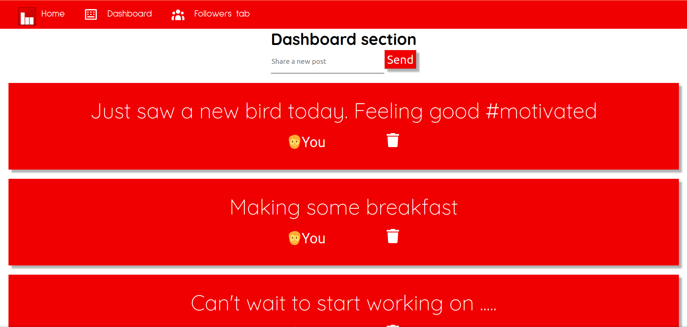

# Minnin

Social media mockup app



## Why this app as created

Proof of concept: This app was created as an example of React state, regular expressions and functions

## How to use

1. Clone repo into desired directory ```git clone https://github.com/Toughee/Minnin.git``` or ```gh repo clone Toughee/Minnin```
2. Run ```npm install``` in your terminal to install all app node modules and dependencies
3. Run ```yarn start``` in your terminal to run app on <http://localhost:3000/>

## Testing tools used for app

- React Testing library and Jest for testing components
- TravisCI and CircleCI for CI/CD development
- Prettier for keeping all code formatted and organized

## Project resources

- [Current roadmap for app](https://github.com/Toughee/Minnin/projects/1)
- [Wiki page for app](https://github.com/Toughee/Minnin/wiki)
- [Documentation for project contributors](https://github.com/Toughee/Minnin/tree/main/docs)

### Completed app tasks

- [x] Include CircleCI and Travis-CI inside project
- [x] Improve U.I. design for app
- [x] Removal option for your own posts

### Future app goals

- [ ] Implement static JSON data of fake users into app
- [ ] Add working like button for posts
- [ ] Add session storage for app to save recently made posts after for each person using Minnin
